<center><font size=10><strong>Project Report</strong></font></center>

<center><font size=5><strong>2020.11.21</strong></font></center>


# 问题 1

## 1. 恒定表面浓度扩散问题

$$
\frac{\part u}{\part t}-D\frac {\part^2 u}{\part x^2}=0
$$
边界条件：$u(0,t)=\rho$，$t>0$

初始条件：$u(x,0)=0$，$x\geq 0$


## 2. 限定源扩散问题


$$
\frac{\part u}{\part t}-D\frac {\part^2 u}{\part x^2}=0
$$
边界条件：$\frac{\part u}{\part x}(0,t)=0$，$t>0$

初始条件：$u(x,0)=\sigma \delta(x)$，$x\geq 0$

 其中 $\delta(x)=\left\{\begin{align}&\infin,&x=0\\&0,&x\not=0\end{align}\right.$


# 问题 2

## 1. 恒定表面浓度扩散问题

​		首先，对方程进行下变换，取
$$
U(x,t) = u(x,t)-\rho
$$
且参数 $D$，$\rho$，$\sigma$ 值为 $1$，由此，上述问题变为：
$$
\frac{\part U}{\part t}-\frac {\part^2 U}{\part x^2}=0\tag1
$$
边界条件：$U(0,t)=0$，$t>0$

初始条件：$U(x,0)=-1$，$x\geq 0$

​		为便于数值计算，先假定 $x$ 存在上界 $L$，求满足边界条件 $U(L,t)=0$。由题目知，需要计算时间范围在 $0<t\leq3$ 的数值解，设 $t$ 的上界为 $T=3$。

​		为导出差分格式，将 $x$ 区域分为 $m$ 段，每段的长度为 $h=L/m$。同时，将时间分为 $n$ 段，每个时间步长为 $k=T/n$。


### 1.1. 后向差分法

**理论分析：**

​		将 $\part^2U/\part x^2$ 近视转换为中心差分估计式，将 $\part u/\part t$ 近视转换为后向差分估计式，由此得到 $(1)$ 式在点 $(i,j)$ 处的有限差分估计：
$$
\frac{U_{i+1,j}-2U_{i,j}+U_{i-1,j}}{h^2}=\frac{U_{i,j}-U_{i,j-1}}{k}
$$
或
$$
U_{i,j-1}=(1+2\lambda)U_{i,j}-\lambda U_{i-1,j}-\lambda U_{i+1,j}
$$
其中 $U_{i,j}=U(ih,jk)$；$\lambda = k/h^2$；$i=1,2,...,m-1$；$j=1,2,...$

​		将其转换为矩阵的形式有：
$$
\begin{equation}
{\left[{\begin{array}{ccccc}
\gamma     &-\lambda  &0        &... &0\\
-\lambda   &\gamma   & -\lambda &...&   0\\
0   &-\lambda    &\gamma &...&   0\\
...   &...    &... &...  &...\\
0   &...    &... &...&   -\lambda\\
0   &...    &... &-\lambda&   \gamma\\
\end{array}}\right]}
{\left[\begin{array}{c}
{U_{1,j}\\
U_{2,j}\\
U_{3,j}\\
...\\
...\\
U_{m-1,j}}
\end{array}
\right]}=
{\left[\begin{array}{c}
{U_{1,j-1}+\lambda U_{0,j}\\
U_{2,j-1}\\
U_{3,j-1}\\
...\\
...\\
U_{m-1,j-1}+\lambda U_{m,j}}
\end{array}
\right]}
\end{equation}
$$
或
$$
A\bold{u}^{(j)}=\bold{u}^{(j-1)}
$$
其中 $\gamma = 1+2\lambda$；$U_{0,j}=0$；$U_{m,j}=0$

​		由于题目中考虑的是半无界空间，所以在求解数值解时需要将 $L$ 尽可能地设为较大值，使另一端边界的扩散情况对 $0<x\leq3$ 空间区域内的浓度的影响小到可以忽略不记。最后求解出 $U(x,t)$ 在 $0<t\leq 3$，$0<x\leq3$ 内的数值解后，再加上 $1$ 得到 $u(x,t)$ 的数值解。


**MATLAB代码：**

文件名：Project_2_1.1.m

输出：Project_2_1.1.csv

```matlab
clear;clc;
% 相关参数的初始化
L=10000; T=3; m=100000; n=30;
h=L/m; k=T/n; a=1;
lambda = a * a * k / (h * h);
l=zeros(m-1,1);
u=zeros(m-1,1);
z=zeros(m-1,1);
w=zeros(m-1,1);
for i = 1:m - 1
    w(i) = -1;
end

% 初始化用于存储结果数据的向量
x_ = zeros(3 / h * 3 / h,1);	%记录x值数据
y_ = zeros(3 / h * 3 / h,1);	%记录t值数据
u_ = zeros(3 / h * 3 / h,1);	%记录u值数据

% 求解线性方程组
l(1) = 1 + 2 * lambda;
u(1) = -lambda / l(1);
for i = 2:m - 2
    l(i) = 1 + 2 * lambda + lambda * u(i - 1);
    u(i) = -lambda / l(i);
end
l(m - 1) = 1 + 2 * lambda + lambda * u(m - 2);
for i = 1:n 
    t = i * k;
    z(1) = w(1) / l(1);
    for j = 2:m-1
        z(j) = (w(j)+lambda*z(j-1))/l(j);
    end
    w(m-1) = z(m-1);
    for j = m-2:-1:1
        w(j) = z(j)-u(j)*w(j+1);
    end
    
    % 记录计算结果
    for j = 1:3 / h
        x_(j+(i-1)*3 / h) = j*h;
        y_(j+(i-1)*3 / h) = t;
        u_(j+(i-1)*3 / h) = w(j)+1;
    end
end

% 输出结果
r_name=["x";"t";"u"];
result_table = table(x_,y_,u_,'VariableNames',r_name);
writetable(result_table,"Project_2_1.1.csv");

% 作图，应用散乱点插值方法
[X,T]=meshgrid(linspace(min(x_),max(x_)),linspace(min(y_),max(y_)));
U=griddata(x_,y_,u_,X,T,'v4');
mesh(X,T,U);
xlabel('x');
ylabel('t');
zlabel('u');
```


**结果展示：**

<center>    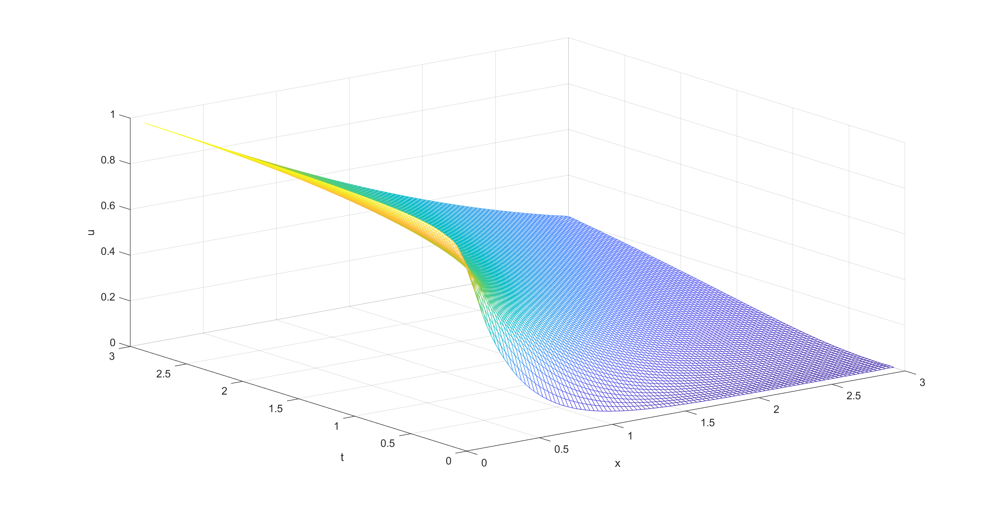    <br>    <div style="color:orange; border-bottom: 1px solid #d9d9d9;    display: inline-block;    color: #999;    padding: 2px;"></div> 恒定表面浓度扩散的后向差分法 - 图 1 </center>

<center>    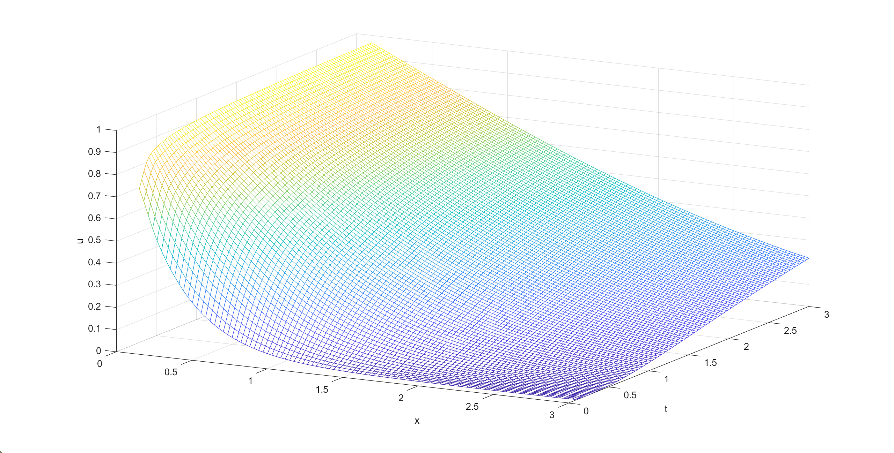    <br>    <div style="color:orange; border-bottom: 1px solid #d9d9d9;    display: inline-block;    color: #999;    padding: 2px;"></div> 恒定表面浓度扩散的后向差分法 - 图 2 </center>

（两图来源于同一计算结果）


### 1.2. Crank-Nicolson方法

**理论分析：**

在时间 $t$ 移动 $j$ 步处的前向差分：
$$
\frac{U_{i+1,j}-2U_{i,j}+U_{i-1,j}}{h^2}=\frac{U_{i,j+1}-U_{i,j}}{k}
$$
其局部截断误差为：
$$
\tau_F=\frac{k}{2}\frac{\part^2U}{\part t^2}(x_i,\mu_j)+O(h^2)
$$
在时间t移动 $j+1$ 步处的后向差分：
$$
\frac{U_{i+1,j+1}-2U_{i,j+1}+U_{i-1,j+1}}{h^2}=\frac{U_{i,j+1}-U_{i,j}}{k}
$$
其局部截断误差为：
$$
\tau_F=-\frac{k}{2}\frac{\part^2U}{\part t^2}(x_i,\hat\mu_j)+O(h^2)
$$
假设 $\frac{\part^2U}{\part t^2}(x_i,\hat\mu_j)\approx\frac{\part^2U}{\part t^2}(x_i,\mu_j)$，可得平均差分下的方法：
$$
\frac 12(\frac{U_{i+1,j}-2U_{i,j}+U_{i-1,j}}{h^2}+\frac{U_{i+1,j+1}-2U_{i,j+1}+U_{i-1,j+1}}{h^2})=\frac{U_{i,j+1}-U_{i,j}}{k}
$$
​		由矩阵的形式表达：
$$
\begin{equation}
A={\left[{\begin{array}{ccccc}
1+\lambda    &-\frac{\lambda}2  &0        &... &0\\
-\frac{\lambda}2   &1+\lambda   & -\frac{\lambda}2 &...&   0\\
0   &-\frac{\lambda}2    &1+\lambda &...&   0\\
...   &...    &... &...  &...\\
0   &...    &... &...&   -\frac{\lambda}2\\
0   &...    &... &-\frac{\lambda}2&   1+\lambda\\
\end{array}}\right]}
\\
B={\left[{\begin{array}{ccccc}
1-\lambda    &\frac{\lambda}2  &0        &... &0\\
\frac{\lambda}2   &1-\lambda   & \frac{\lambda}2 &...&   0\\
0   &\frac{\lambda}2    &1-\lambda &...&   0\\
...   &...    &... &...  &...\\
0   &...    &... &...&   \frac{\lambda}2\\
0   &...    &... &\frac{\lambda}2&   1-\lambda\\
\end{array}}\right]}\\
A\bold{w}^{(j+1)}=B\bold{w}^{(j)}
\end{equation}
$$
其中 $\lambda=k/h^2$；$w^{(j)}=(w_{1,j},w_{2,j},..,w_{m-1,j})^t$

​		同样，在求解时将 $L$ 尽可能地设为较大值。


**MATLAB代码：**

文件名：Project_2_1.2.m

输出：Project_2_1.2.csv

```matlab
clear;clc;
% 相关参数的初始化
L=10000; T=3; m=100000; n=30;
h=L/m; k=T/n; a=1;
lambda = a * a * k / (h * h);
l=zeros(m-1,1);
u=zeros(m-1,1);
z=zeros(m-1,1);
w=zeros(m,1);
w(m) = -1;
for i = 1:m - 1 
    w(i) = -1;
end

% 初始化用于存储结果数据的向量
x_ = zeros(3 / h * 3 / h,1);	%记录x值数据
y_ = zeros(3 / h * 3 / h,1);	%记录t值数据
u_ = zeros(3 / h * 3 / h,1);	%记录u值数据

% 求解线性方程组
l(1) = 1 + lambda;
u(1) = -lambda/(2*l(1));
for i = 2:m-2
    l(i) = 1 + lambda + lambda*u(i-1)/2;
    u(i) = -lambda/(2*l(i));
end
l(m-1) = 1 + lambda + lambda*u(m-2)/2;
for i = 1:n
    t = i*k;
    z(1) = ((1-lambda)*w(1)+lambda/2*w(2))/l(1);
    for j = 2:m-1
        z(j)=((1-lambda)*w(j)+lambda/2*(w(j+1)+w(j-1)+z(j-1)))/l(j);
    end
    w(m-1) = z(m-1);
    for j = m-2:-1:1
        w(j) = z(j) - u(j)*w(j+1);
    end

    % 记录计算结果
    for j = 1:3 / h
        x_(j+(i-1)*3 / h) = j*h;
        y_(j+(i-1)*3 / h) = t;
        u_(j+(i-1)*3 / h) = w(j)+1;
    end
end

% 输出结果
r_name=["x";"t";"u"];
result_table = table(x_,y_,u_,'VariableNames',r_name);
writetable(result_table,"Project_2_1.2.csv");

% 作图，应用散乱点插值方法
[X,T]=meshgrid(linspace(min(x_),max(x_)),linspace(min(y_),max(y_)));
U=griddata(x_,y_,u_,X,T,'v4');
mesh(X,T,U);
xlabel('x');
ylabel('t');
zlabel('u');
```


**结果展示：**

<center>    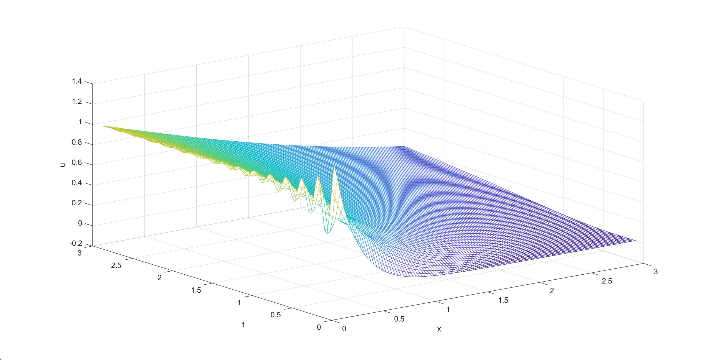    <br>    <div style="color:orange; border-bottom: 1px solid #d9d9d9;    display: inline-block;    color: #999;    padding: 2px;"></div> 恒定表面浓度扩散的Crank-Nicolson方法 - 图 1 </center>

<center>    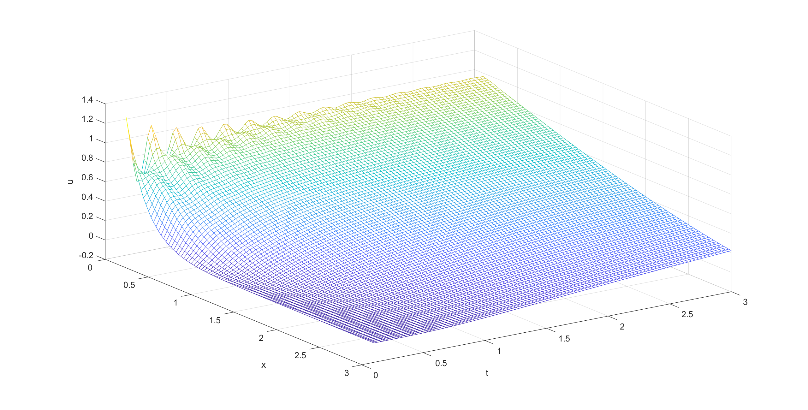    <br>    <div style="color:orange; border-bottom: 1px solid #d9d9d9;    display: inline-block;    color: #999;    padding: 2px;"></div> 恒定表面浓度扩散的Crank-Nicolson方法 - 图 2 </center>

（两图来源于同一计算结果）


## 2. 限定源扩散问题

​		由于脉冲响应函数在数值上不方便处理，即使处理后也会有较大的误差。于是需要对原问题的初始条件进行处理：将某一时间点 $t(t\not=0)$ 设为扩散初始点，此时 $t$ 不为0，不会出现有某一处的浓度呈现无穷大的情况，通过该问题的解析解可以计算出该时间点下不同 $x$ 处的浓度数值。

​		为便于数值计算，假定 $x$ 存在上界 $L$，且为构建边界条件 $U(L,t)=0$，假定扩散发生在 $x=L/2$ 处。由题目知，需要计算时间范围在 $0<t\leq3$ 的数值解，设 $t$ 的上界为 $T=3$。为导出差分格式，将 $x$ 区域分为 $m$ 段，每段的长度为 $h=L/m$。同时，将时间分为 $n$ 段，每个时间步长为 $k=T/n$，假设 $t=k$ 为扩散初始点。已知参数 $D$，$\rho$，$\sigma$ 值为 $1$，问题转换为：


$$
\frac{\part U}{\part t}-\frac {\part^2 U}{\part x^2}=0
$$
边界条件：$U(0,t)=0$，$t>0$

初始条件：$U(x,0)=(\frac{1}{\sqrt{\pi k}})e^{-\frac{x^2}{4k}}$，$x\geq 0$

 

### 2.1. 后向差分法

**理论分析：**

​		同 1.1. 处的理论分析


**MATLAB代码：**

文件名：Project_2_2.1.m

输出：Project_2_2.1.csv

```matlab
clear;clc;
% 相关参数的初始化
L=10000; T=3; m=100000; n=30;
h=L/m; k=T/n; a=1;
lambda = a * a * k / (h * h);
l=zeros(m-1,1);
u=zeros(m-1,1);
z=zeros(m-1,1);
w=zeros(m-1,1);
for i = 1:m - 1
    % 将L=5000处设为扩散开始处，并把t=0.1时各点浓度数值作为初始值
    w(i) = 1/sqrt(pi*0.1)*exp(-((50000-i)*0.1)^2/(4*0.1));
end

% 初始化用于存储结果数据的向量
x_ = zeros(3 / h * 3 / h,1);	%记录x值数据
y_ = zeros(3 / h * 3 / h,1);	%记录t值数据
u_ = zeros(3 / h * 3 / h,1);	%记录u值数据

% 记录t=0.1时的数据
for j = 1:3 / h
    x_(j) = j*h;
    y_(j) = 0.1;
    u_(j) = w(50000+j);
end

% 求解线性方程组
l(1) = 1 + 2 * lambda;
u(1) = -lambda / l(1);
for i = 2:m - 2
    l(i) = 1 + 2 * lambda + lambda * u(i - 1);
    u(i) = -lambda / l(i);
end
l(m - 1) = 1 + 2 * lambda + lambda * u(m - 2);
for i = 1:n-1
    t = (1+i) * k;
    z(1) = w(1) / l(1);
    for j = 2:m-1
        z(j) = (w(j)+lambda*z(j-1))/l(j);
    end
    w(m-1) = z(m-1);
    for j = m-2:-1:1
        w(j) = z(j)-u(j)*w(j+1);
    end
    
    % 记录计算结果
    for j = 1:3 / h
        x_(j+i*3 / h) = j*h;
        y_(j+i*3 / h) = t;
        u_(j+i*3 / h) = w(50000+j);
    end
end

% 输出结果
r_name=["x";"t";"u"];
result_table = table(x_,y_,u_,'VariableNames',r_name);
writetable(result_table,"Project_2_2.1.csv");

% 作图，应用散乱点插值方法
[X,T]=meshgrid(linspace(min(x_),max(x_)),linspace(min(y_),max(y_)));
U=griddata(x_,y_,u_,X,T,'v4');
mesh(X,T,U);
xlabel('x');
ylabel('t');
zlabel('u');
```


**结果展示：**

<center>    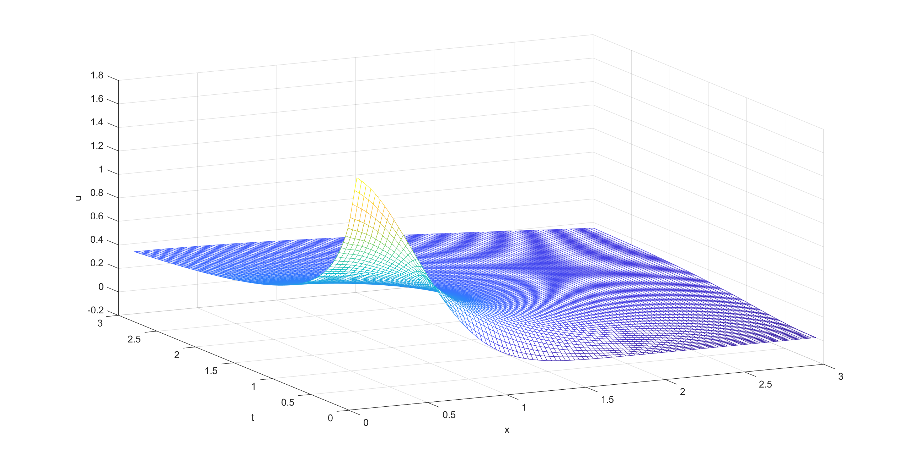    <br>    <div style="color:orange; border-bottom: 1px solid #d9d9d9;    display: inline-block;    color: #999;    padding: 2px;"></div> 限定源扩散的后向差分法 - 图 1 </center>

<center>    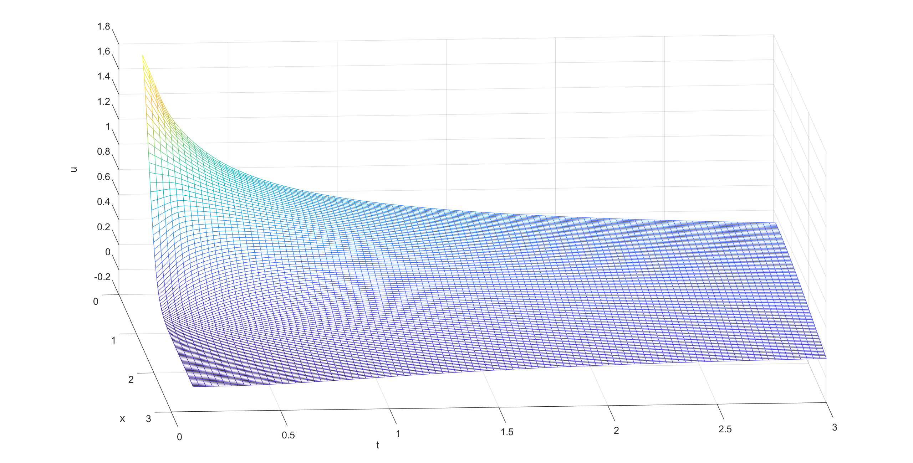    <br>    <div style="color:orange; border-bottom: 1px solid #d9d9d9;    display: inline-block;    color: #999;    padding: 2px;"></div> 限定源扩散的后向差分法 - 图 2 </center>

（两图来源于同一计算结果）


### 2.2. Crank-Nicolson方法

**理论分析：**

​		同 1.2. 处的理论分析


**MATLAB代码：**

文件名：Project_2_2.2.m

输出：Project_2_2.2.csv

```matlab
clear;clc;
% 相关参数的初始化
L=10000; T=3; m=100000; n=30;
h=L/m; k=T/n; a=1;
lambda = a * a * k / (h * h);
l=zeros(m-1,1);
u=zeros(m-1,1);
z=zeros(m-1,1);
w=zeros(m,1);
for i = 1:m
    % 将L=5000处设为扩散开始处，并把t=0.1时各点浓度数值作为初始值
    w(i) = 1/sqrt(pi*0.1)*exp(-((50000-i)*0.1)^2/(4*0.1));
end

% 初始化用于存储结果数据的向量
x_ = zeros(3 / h * 3 / h,1);	%记录x值数据
y_ = zeros(3 / h * 3 / h,1);	%记录t值数据
u_ = zeros(3 / h * 3 / h,1);	%记录u值数据

% 记录t=0.1时的数据
for j = 1:3 / h
    x_(j) = j*h;
    y_(j) = 0.1;
    u_(j) = w(50000+j);
end

% 求解线性方程组
l(1) = 1 + lambda;
u(1) = -lambda/(2*l(1));
for i = 2:m-2
    l(i) = 1 + lambda + lambda*u(i-1)/2;
    u(i) = -lambda/(2*l(i));
end
l(m-1) = 1 + lambda + lambda*u(m-2)/2;
for i = 1:n - 1
    t = (i+1)*k;
    z(1) = ((1-lambda)*w(1)+lambda/2*w(2))/l(1);
    for j = 2:m-1
        z(j)=((1-lambda)*w(j)+lambda/2*(w(j+1)+w(j-1)+z(j-1)))/l(j);
    end
    w(m-1) = z(m-1);
    for j = m-2:-1:1
        w(j) = z(j) - u(j)*w(j+1);
    end

    % 记录计算结果
    for j = 1:3 / h
        x_(j+i*3 / h) = j*h;
        y_(j+i*3 / h) = t;
        u_(j+i*3 / h) = w(50000+j);
    end
end

% 输出结果
r_name=["x";"t";"u"];
result_table = table(x_,y_,u_,'VariableNames',r_name);
writetable(result_table,"Project_2_2.2.csv");

% 作图，应用散乱点插值方法
[X,T]=meshgrid(linspace(min(x_),max(x_)),linspace(min(y_),max(y_)));
U=griddata(x_,y_,u_,X,T,'v4');
mesh(X,T,U);
xlabel('x');
ylabel('t');
zlabel('u');
```


**结果展示：**

<center>    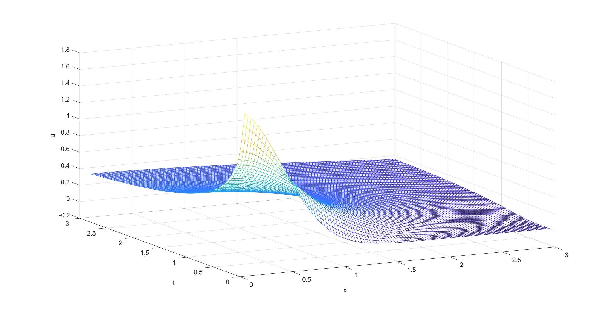    <br>    <div style="color:orange; border-bottom: 1px solid #d9d9d9;    display: inline-block;    color: #999;    padding: 2px;"></div> 限定源扩散的Crank-Nicolson法 - 图 1 </center>

<center>    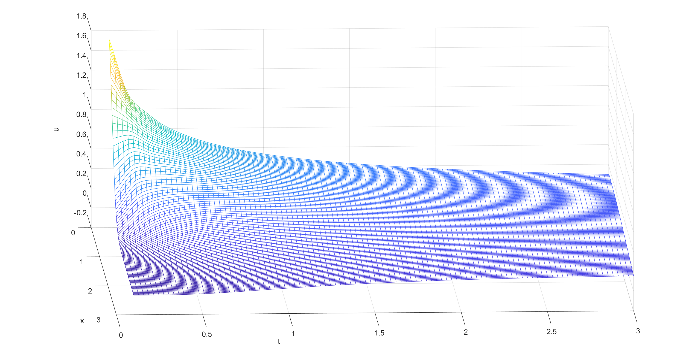    <br>    <div style="color:orange; border-bottom: 1px solid #d9d9d9;    display: inline-block;    color: #999;    padding: 2px;"></div> 限定源扩散的Crank-Nicolson法 - 图 2 </center>

（两图来源于同一计算结果）


# 问题 3

## 1. 恒定表面浓度扩散问题

### 1.1. 解析解结果

对于该问题，解析解为:
$$
u(x,t)=\rho \mbox{erfc}(\frac{x}{2\sqrt{Dt}})
$$
其中参数 $D$，$\rho$，$\sigma$ 值为 $1$，$\mbox{efrc}()$ 为余误差函数。


**MATLAB代码：**

文件名：Project_3_1.1.m

```matlab
clear;clc;
x=(0.1:0.05:3);
y=(0.1:0.05:3);
[X,Y] = meshgrid(x,y);
% 计算u值的矩阵
Z=erfc(X./(2.*sqrt(Y)));
% 作图
mesh(X,Y,Z);
xlabel('x');
ylabel('t');
zlabel('u');
```


**结果展示：**

<center>    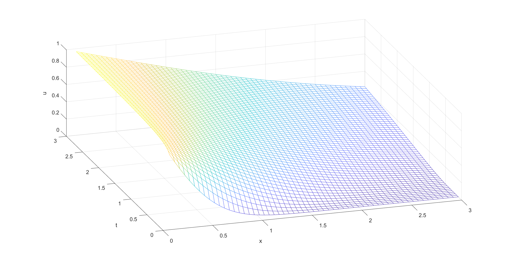    <br>    <div style="color:orange; border-bottom: 1px solid #d9d9d9;    display: inline-block;    color: #999;    padding: 2px;"></div> 恒定表面浓度扩散的解析解 - 图 1 </center>

<center>    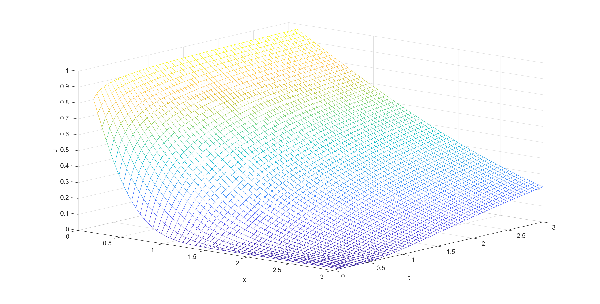    <br>    <div style="color:orange; border-bottom: 1px solid #d9d9d9;    display: inline-block;    color: #999;    padding: 2px;"></div> 恒定表面浓度扩散的解析解 - 图 2 </center>

（两图来源于同一计算结果）


### 1.2. 分析

#### 1.2.1. 后向差分法

**MATLAB代码：**

见文件：Project_3_1.2.1.m


**误差值：**

<center>    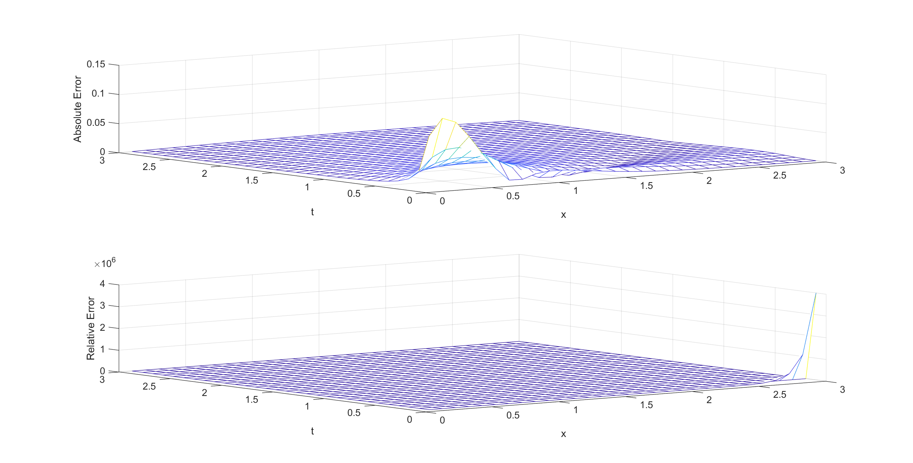    <br>    <div style="color:orange; border-bottom: 1px solid #d9d9d9;    display: inline-block;    color: #999;    padding: 2px;"></div> 后向差分法求解恒定表面浓度扩散问题的误差 - 图 1 </center>

<center>    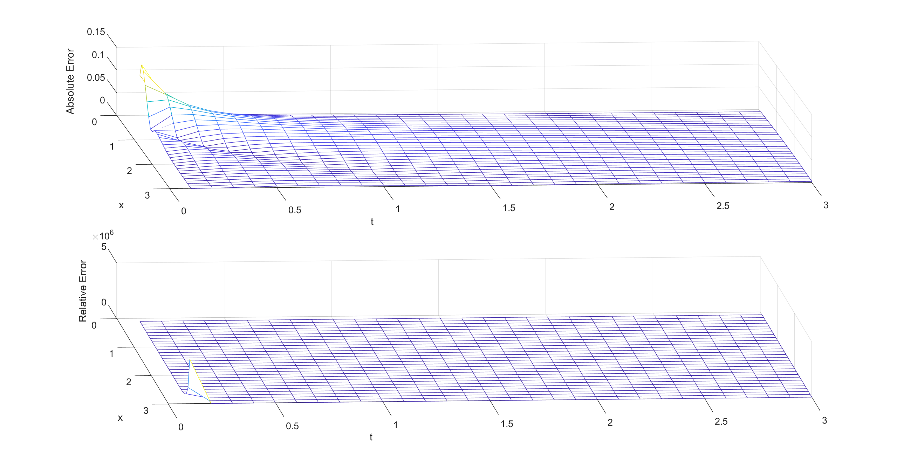    <br>    <div style="color:orange; border-bottom: 1px solid #d9d9d9;    display: inline-block;    color: #999;    padding: 2px;"></div> 后向差分法求解恒定表面浓度扩散问题的误差 - 图 2 </center>

（两图来源于同一计算结果）


#### 1.2.2. Crank-Nicolson方法

**MATLAB代码：**

见文件：Project_3_1.2.2.m


**误差值：**

<center>    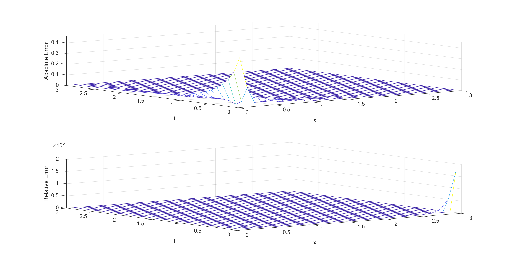    <br>    <div style="color:orange; border-bottom: 1px solid #d9d9d9;    display: inline-block;    color: #999;    padding: 2px;"></div> Crank-Nicolson法求解恒定表面浓度扩散问题的误差 - 图 1 </center>

<center>    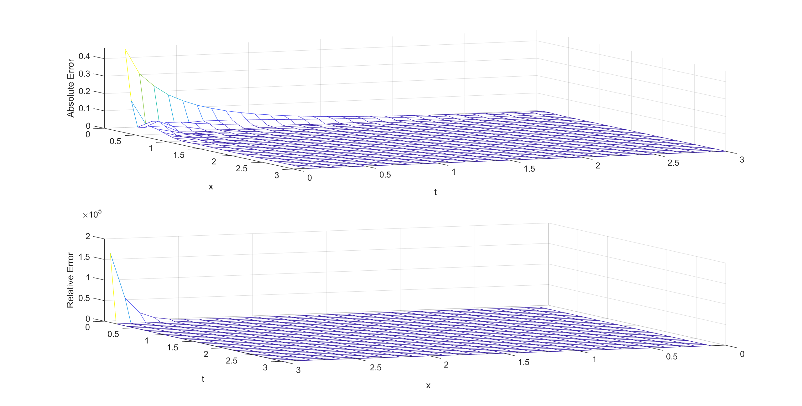    <br>    <div style="color:orange; border-bottom: 1px solid #d9d9d9;    display: inline-block;    color: #999;    padding: 2px;"></div> Crank-Nicolson法求解恒定表面浓度扩散问题的误差 - 图 2 </center>

（两图来源于同一计算结果）


## 2. 限定源扩散问题

### 2.1. 解析解结果

对于该问题，解析解为:
$$
u(x,t)=(\frac{\sigma}{\sqrt{D\pi t}})e^{-\frac{x^2}{4Dt}}
$$
其中参数 $D$，$\rho$，$\sigma$ 值为 $1$


**MATLAB代码：**

文件名：Project_3_2.1.m

```matlab
clear;clc;
x=(0.1:0.05:3);
y=(0.1:0.05:3);
[X,Y] = meshgrid(x,y);
% 计算u值的矩阵
Z=1./sqrt(pi.*Y).*exp(-X.^2./(4.*Y));
% 作图
mesh(X,Y,Z);
xlabel('x');
ylabel('t');
zlabel('u');
```


**结果展示：**

<center>    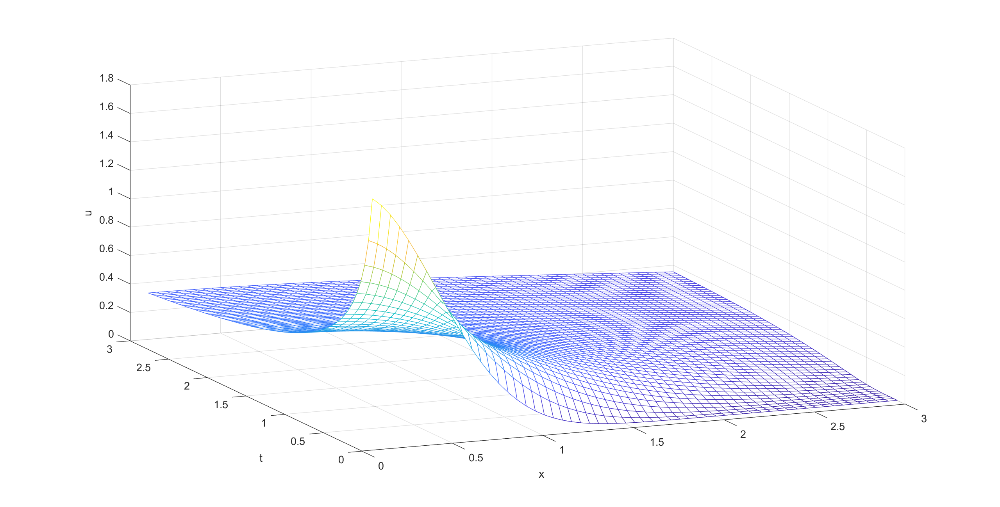    <br>    <div style="color:orange; border-bottom: 1px solid #d9d9d9;    display: inline-block;    color: #999;    padding: 2px;"></div> 限定源扩散的解析解 - 图 1 </center>

<center>    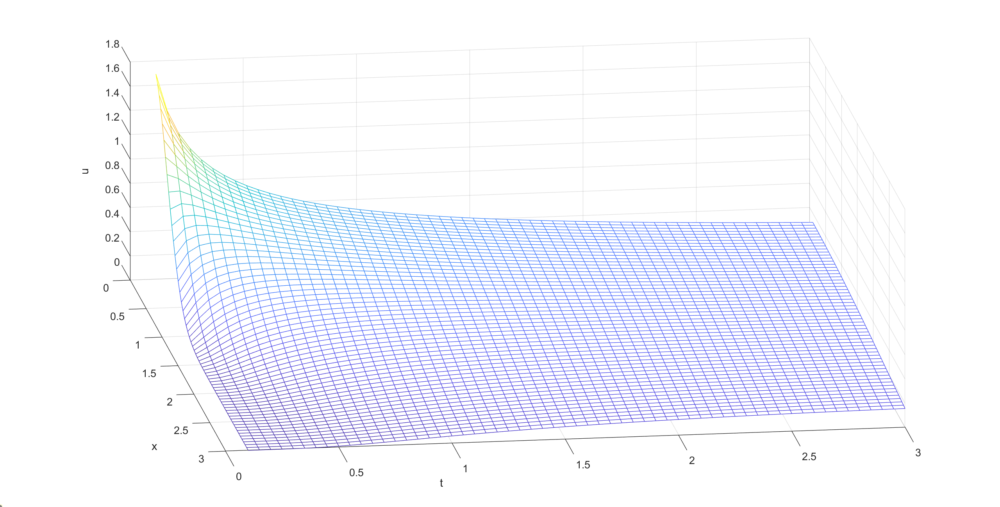    <br>    <div style="color:orange; border-bottom: 1px solid #d9d9d9;    display: inline-block;    color: #999;    padding: 2px;"></div> 限定源扩散的解析解 - 图 2 </center>

（两图来源于同一计算结果）


### 2.2. 分析

#### 2.2.1. 后向差分法

**MATLAB代码：**

见文件：Project_3_2.2.1.m


**误差值：**

<center>    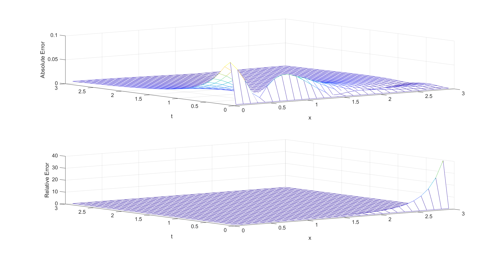    <br>    <div style="color:orange; border-bottom: 1px solid #d9d9d9;    display: inline-block;    color: #999;    padding: 2px;"></div> 后向差分法求解限定源扩散问题的误差 - 图 1 </center>

<center>    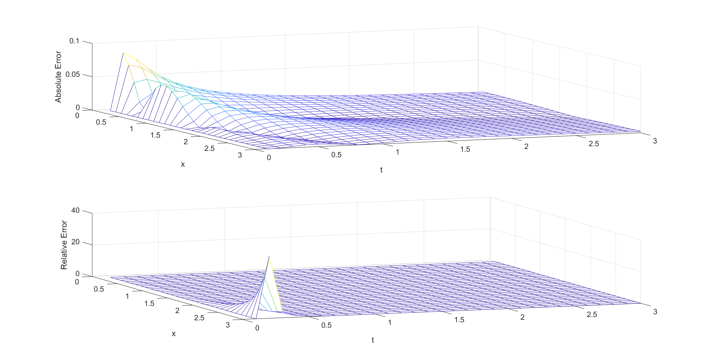    <br>    <div style="color:orange; border-bottom: 1px solid #d9d9d9;    display: inline-block;    color: #999;    padding: 2px;"></div> 后向差分法求解限定源扩散问题的误差 - 图 2 </center>

（两图来源于同一计算结果）


#### 2.2.2. Crank-Nicolson方法

**MATLAB代码：**

见文件：Project_3_2.2.2.m


**误差值：**

<center>    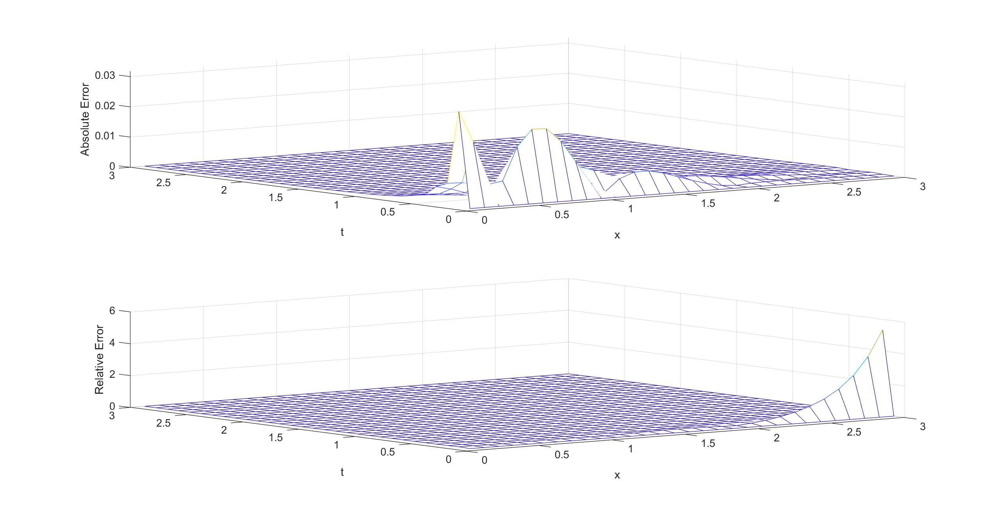    <br>    <div style="color:orange; border-bottom: 1px solid #d9d9d9;    display: inline-block;    color: #999;    padding: 2px;"></div> Crank-Nicolson法求解限定源扩散问题的误差 - 图 1 </center>

<center>    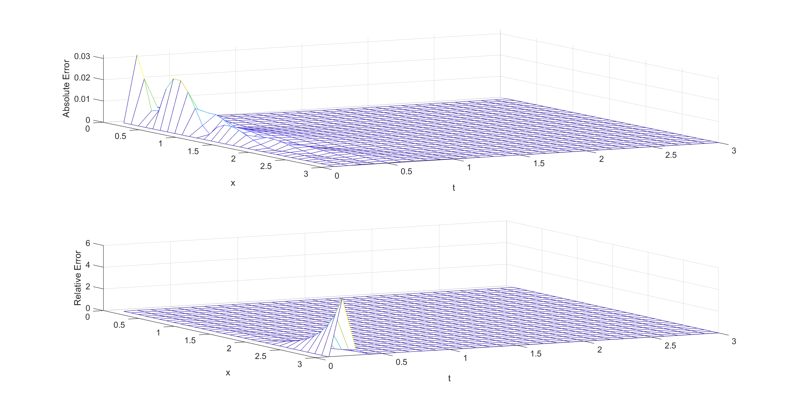    <br>    <div style="color:orange; border-bottom: 1px solid #d9d9d9;    display: inline-block;    color: #999;    padding: 2px;"></div> Crank-Nicolson法求解限定源扩散问题的误差 - 图 2 </center>

（两图来源于同一计算结果）


## 3. 总结

​		对于恒定表面浓度扩散问题和限定源扩散问题的数值求解中，本文应用了后向差分法和Crank-Nicolson方法。

​		对于恒定表面浓度扩散问题，由问题2中可知，Crank-Nicolson方法的计算结果在 $x$ 较小的时候，其数值解与解析解对比有着很大的波动，从而导致较大的误差，且在同一 $x$ 下，$t$ 越小波动越明显，在同一 $t$ 下，$x$ 越大波动越小。相比之下，后向差分法的结果整体上更为稳定。对于限定源浓度扩散问题，两个方法表现情况相似。

​		整体上，由误差分析图可知，在 $x$ 和 $t$ 较小时，误差都相对较大。其次，在 $t$ 较小，$x$ 较大时，每个两个求解方法下的两个问题，都表现出来较大的相对误差，查看数据发现，这部分区域的解析解值和数值解值都非常小，其原因很可能是浮点运算误差导致。